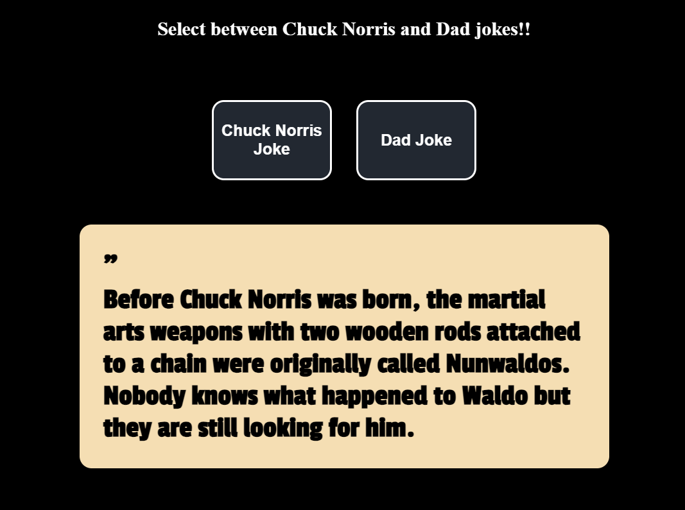

<h3 align="center">Joke Generato</h3>

<h3 align="center">Personal project for me to enhance my JavaScript skills.</h3>

<h3 align="center">https://jokes-ag.web.app/</h3>

## Table Of Contents

- [Table Of Contents](#table-of-contents)
- [About The Project](#about-the-project)
- [Showcase](#showcase)
- [Getting Started](#getting-started)
- [Authors](#authors)

## About the project

Welcome to my "Joke Generator" project! 😄

This project is a fun exploration into the world of programming and jokes, brought to life with the power of JavaScript and APIs. By leveraging fetch requests to Chuck Norris and Dad joke APIs, users can enjoy a chuckle at the click of a button.

**Objective**:

With this project, my aim is to showcase my proficiency in working with APIs and handling asynchronous data in JavaScript. By implementing dynamic joke generation based on user preferences, I'm demonstrating my ability to create interactive and engaging web applications. This project not only highlights my technical skills but also reflects my passion for creating enjoyable user experiences through code.

## Showcase

`/`

## Getting Started

To enjoy the silly jokes simply press the link below.

https://jokes-ag.web.app/

## Authors

- _Arminas Griesius_ - Front End developer - [Arminas Griesius](https://github.com/ArminasGriesius) - All Work
